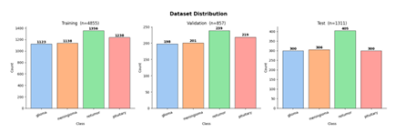
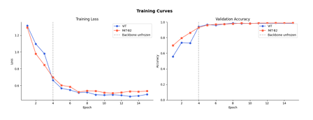
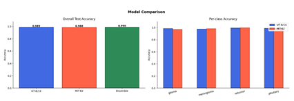
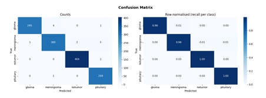
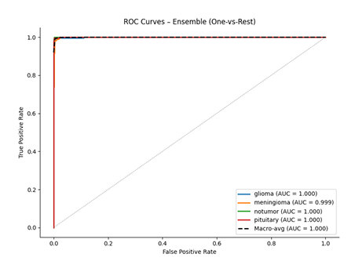
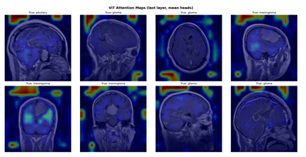

# 🧠 ViT–MiT Brain Tumor Classification (IEEE Research Implementation)

This repository presents an implementation of a **hybrid Vision Transformer (ViT) and Mix Transformer (MiT) ensemble** for **multiclass brain tumor classification using MRI images**, developed as part of an IEEE-style research study.

The model classifies MRI scans into:
- Glioma  
- Meningioma  
- Pituitary Tumor  
- No Tumor  

**Performance:**
- **Test Accuracy:** 99.01%  
- **Macro F1-score:** 0.99  

---

## 🔍 Key Features

- Hybrid **ViT + MiT ensemble**
- Logit-level fusion (**α = 0.6**)
- Progressive transfer learning
- Cosine learning-rate scheduling with warmup
- Automatic Mixed Precision (AMP)
- Test-Time Augmentation (TTA)
- Attention-based explainability

---

## 📊 Dataset

- **Total Images:** 7,200  
- **Balanced across 4 classes**

| Split | Images per Class | Total |
|------|----------------|------|
| Train | 1,400 | 5,600 |
| Test | 400 | 1,600 |

**Source:**  
J. Cheng, *Brain Tumor Dataset*, figshare (2017)  
https://doi.org/10.6084/m9.figshare.1512427.v5  

---

## 🧱 Model Overview

### Vision Transformer (ViT)
Captures **global spatial dependencies** using self-attention.

### Mix Transformer (MiT - SegFormer)
Extracts **hierarchical multi-scale features**.

### Ensemble Fusion
z_ens = α · z_ViT + (1 − α) · z_MiT, α = 0.6


---

## ⚙️ Training Strategy

- **Optimizer:** AdamW  
- **Epochs:** 50  
- **Batch Size:** 32  
- **Hardware:** NVIDIA T4  

### Key Techniques
- Progressive backbone unfreezing  
- Cosine learning-rate schedule with warmup  
- Label smoothing  
- Automatic Mixed Precision (AMP)  

---

## 🧪 Preprocessing

- Resize: 224 × 224  
- ImageNet normalization  

**Augmentations:**
- Horizontal flip  
- Rotation (±10°)  

---

# 📈 Results & Visualizations

> Brain Tumor Classification · ViT–MiT Ensemble · IEEE Study

---

<div align="center">


</div>

---

## Dataset Distribution

<div align="center">
  
</div>

*Balanced class-wise distribution across training and testing splits, ensuring unbiased evaluation.*

---

## Training Curves

<div align="center">
  
</div>

*Training loss and validation accuracy across 50 epochs with progressive unfreezing, showing stable convergence.*

---

## Model Comparison · Confusion Matrix

<div align="center">
  <table>
    <tr>
      <td align="center" width="50%">
        
        <br/>
        <sub><b>Model Comparison</b> — ViT vs MiT vs Ensemble</sub>
      </td>
      <td align="center" width="50%">
        
        <br/>
        <sub><b>Confusion Matrix</b> — 4-Class Classification</sub>
      </td>
    </tr>
  </table>
</div>

*Performance comparison across models. Strong diagonal concentration indicates high classification accuracy across all classes.*

---

## ROC Curve

<div align="center">
  
</div>

*High separability across tumor classes with strong AUC characteristics under one-vs-rest evaluation.*

---

## Attention Maps

<div align="center">
  
</div>

*Attention visualizations highlight clinically relevant tumor regions, supporting model interpretability.*

---

## 📄 Research Context

This work corresponds to an **IEEE-format research study** on:

**Hybrid Vision Transformer and Mix Transformer Ensemble for Multiclass Brain Tumor Classification Using MRI Images**

Includes:
- Independent test evaluation  
- Ablation study  
- Class-wise metrics  
- Attention-based interpretability  

---

## ⚠️ Limitations

- Based on 2D MRI slices  
- Limited dataset diversity  
- Visual similarity between meningioma and glioma  

---

## 🚀 Future Work

- Extension to 3D MRI data  
- Multi-institution validation  
- Further robustness evaluation  

---

## 📜 License

This project is intended for **academic and research use**.

- Code: Open for educational and research purposes  
- Dataset: Subject to original figshare license  
- Research aligned with IEEE publication standards  

---

## 🙏 Acknowledgment

- SRM Institute of Science and Technology  
- Public MRI dataset contributors  

---

## ⭐ Citation

```bibtex
@article{vit_mit_brain_tumor,
  title={Hybrid Vision Transformer and Mix Transformer Ensemble for Multiclass Brain Tumor Classification Using MRI Images},
  author={Grover, Hardik and others},
  year={2026}
}
